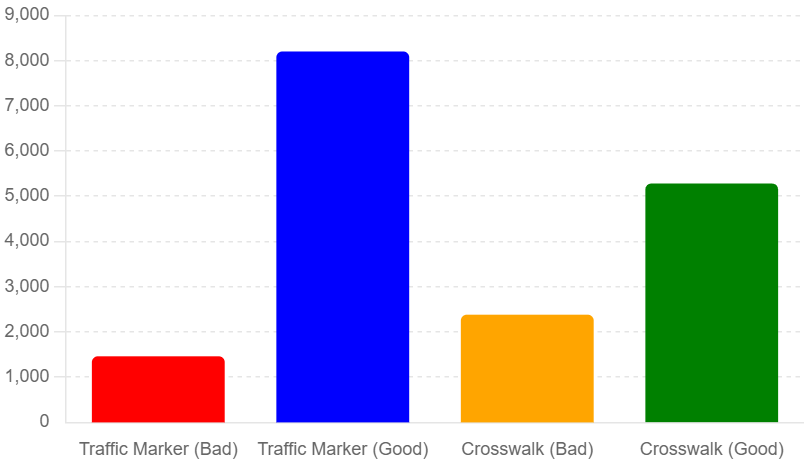

# Intersection Markings Dataset

Welcome to the Intersection Markings Dataset repository. This comprehensive dataset is designed to assist urban planners, transportation agencies, researchers, and anyone interested in the maintenance and management of road infrastructure. Utilizing advanced artificial intelligence techniques, our dataset provides detailed annotations and conditions of various intersection markings, including lane-use arrows and crosswalks.

## Table of Contents

1. [Introduction](#introduction)
2. [Data Features](#data-features)
3. [Annotation Statistics](#annotation-statistics)
4. [Visualizations](#visualizations)
5. [Applications](#applications)
6. [Accessibility](#accessibility)
7. [Citation](#citation)
8. [Contact](#contact)

## Introduction

Our comprehensive dataset is an invaluable resource for urban planners, transportation agencies, researchers, and anyone interested in the maintenance and management of road infrastructure. Utilizing advanced artificial intelligence techniques, our dataset provides detailed annotations and conditions of various intersection markings, including lane-use arrows and crosswalks.

## Data Features

The dataset contains the following key features for each annotated marking:

- **Intersection ID:** A unique identifier for each intersection.
- **Marking Type:** Specifies whether the marking is a lane-use arrow or a crosswalk.
- **Marking Subtype:** Detailed categorization within each type (e.g., Left, Right, Zebra, Ladder).
- **Condition Assessment:** Quality condition from 0 (lowest) to 1 (highest), indicating the degradation level of the markings.
- **Bounding Box Coordinates:** The coordinates defining the position and size of the marking in the image.

## Annotation Statistics

The following table summarizes the annotation statistics:

| Label           | Annotation | Total  |
|-----------------|------------|--------|
| left            | 4620       | 4621   |
| straight        | 1058       | 1058   |
| right           | 2620       | 2621   |
| leftstraight    | 658        | 658    |
| rightstraight   | 704        | 704    |
| CS_1            | 4782       | 4782   |
| CS_2            | 2117       | 2118   |
| CS_3            | 764        | 764    |
| **Total**       | **9661**   | **17326** |

## Visualizations

We have included several visualizations to help understand the distribution and condition of the markings:

1. **Crosswalk Distribution**  
   

2. **Traffic Marker Distribution**  
   

3. **Condition Distribution**  
   

4. **Arrow Condition and Crosswalk Condition**  
   

## Applications

This dataset is essential for various applications, including but not limited to:

- **Safety Management:** Providing critical data for hotspot identification and before-after safety evaluation.
- **Infrastructure Maintenance:** Assisting in the prioritization of maintenance tasks based on the degradation conditions of the markings.
- **Urban Planning:** Supporting the development of detailed urban infrastructure models for intelligent transportation systems (ITS) and other planning purposes.

## Accessibility

We believe this dataset will significantly contribute to advancements in urban science, infrastructure management, and safety enhancement. Thank you for your interest and we look forward to your feedback and collaboration.

You can download the dataset on [Google Drive](https://drive.google.com/file/d/1BGqtjFWEX9rdQlQFU51foIbPkTbZ08C6/view?usp=drive_link).

## Citation

If you use our dataset in your research or work, please cite the following paper:

Xie, K., Sun, H., Dong, X., Yang, H., & Yu, H. (2023). Automating intersection marking data collection and condition assessment at scale with an artificial intelligence-powered system. Computational Urban Science, 3(1), 24.

## Contact

If you have any questions, please contact us at [sunhuiming55@gmail.com](mailto:sunhuiming55@gmail.com).

---

&copy; 2024 Intersection Markings Dataset. All rights reserved.
